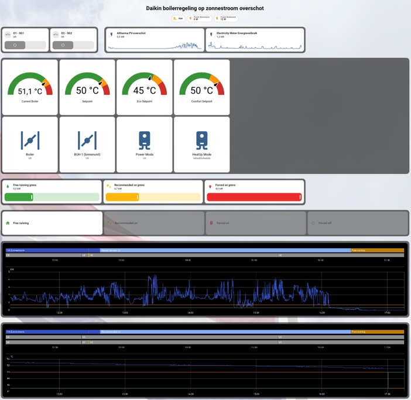
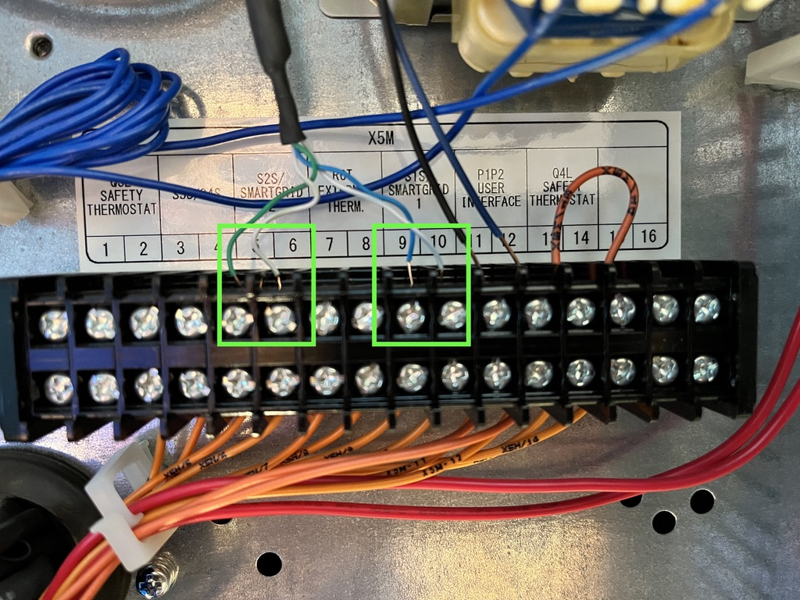
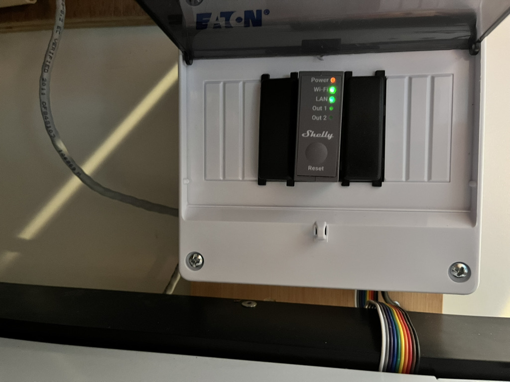

# Daikin Altherma Smart Grid + Home Assistant + PV Surplus

Automatische aansturing van een **Daikin Altherma 3 R F** via de ingebouwde **Smart Grid-functionaliteit**, waarbij Home Assistant de Smart Grid operation mode bepaalt op basis van het actuele PV-overschot.

De regeling gebruikt twee potentiaalvrije relais voor **SG1** en **SG2** en ondersteunt de vier officiële Daikin Smart Grid operation modes:

- 🟢 **Free running**
- ⚪ **Forced off**
- 🟡 **Recommended on**
- 🔴 **Forced on**

Korte PV-fluctuaties worden genegeerd door een wachttijd van 10 minuten. Handmatige wijzigingen van SG1/SG2 worden na 5 minuten opnieuw beoordeeld.

> ⚠️ **Veiligheid**
>
> Werkzaamheden aan de elektrische installatie en de Daikin-aansluitingen mogen alleen worden uitgevoerd door een vakbekwaam installateur. Controleer altijd de installatiehandleiding van jouw specifieke Altherma-model. De configuratie hieronder is een voorbeeld voor de beschreven installatie en moet niet blind worden overgenomen voor andere modellen.

---

## 📁 Repository structure

```text
daikin-altherma-smart-grid/
│
├── README.md
│
├── home-assistant/
│   ├── template_sensor.yaml
│   ├── smart_grid_scripts.yaml
│   └── pv_automation.yaml
│
└── docs/
    └── wiring.md
```

---

# 1. Hardware

## Daikin Altherma

Voorbeeldinstallatie:

```text
Outdoor unit:
ERGA08EAV3H7

Indoor unit:
EHVH08S23EJ6V
```

De installatie beschikt over een geïntegreerd DHW-reservoir van ongeveer 230 liter.

---
## Dashboard

<p align="center">
  
</p>


# 2. Smart Grid wiring

## Smart Grid aansluiting

<p align="center">
  
</p>

<p align="center">
  
</p>

## Smart Grid – Shelly Pro 2

<p align="center">
  
</p>


De Daikin Smart Grid-functionaliteit gebruikt twee contacten:

- **SG1 / S10S**
- **SG2 / S11S**

Voor deze installatie:

| Smart Grid | Daikin terminal | Home Assistant relais |
|---|---|---|
| SG1 / S10S | X5M.9 – X5M.10 | Shelly O1 |
| SG2 / S11S | X5M.5 – X5M.6 | Shelly O2 |

Schematisch:


                 Daikin Altherma
              ┌──────────────────┐
              │                  │
              │ SG1 / S10S       │
              │ X5M.9 ── X5M.10 │
              │       ▲          │
              │       │          │
              │      O1          │
              │                  │
              │ SG2 / S11S       │
              │ X5M.5 ── X5M.6  │
              │       ▲          │
              │       │          │
              │      O2          │
              └───────┬──────────┘
                      │
                  Shelly Pro 2
                      │
                      ▼
                Home Assistant


Home Assistant:

= **SG1**
```yaml
switch.zolder_altherma_boiler_switch_o1
```

= **SG2**
```yaml
switch.zolder_altherma_boiler_switch_o2
```

> Controleer de klembezetting altijd met het aansluitschema van de gebruikte Daikin-unit. De klemnummers kunnen per model verschillen.

---

# 3. Smart Grid operation modes

De combinatie van SG1 en SG2 bepaalt de toestand.

| SG1 | SG2 | Daikin mode |
|---|---|---|
| OFF | OFF | 🟢 Free running |
| OFF | ON | ⚪ Forced off |
| ON | OFF | 🟡 Recommended on |
| ON | ON | 🔴 Forced on |

Dit is de centrale mapping die ook in Home Assistant wordt gebruikt.

---

# 4. Daikin MMI configuration

Ga naar de installateursinstellingen van de Daikin MMI.

## Smart Grid

| Setting | Value |
|---|---:|
| `[9.8.4] Benefit kWh power supply` | `4` |
| `[9.8.5] Smart Grid operation mode` | `25` |
| `[9.8.6] Allow electrical heaters` | `No` |
| `[9.8.7] Enable room buffering` | `No` |
| `[9.8.8] Limit setting kW` | `3` |

## DHW

| Setting | Value |
|---|---:|
| Eco | `45 °C` |
| Comfort | `50 °C` |
| Reheat / Warmhouden | `45 °C` |
| Maximum DHW temperature | `60 °C` |
| Powerful DHW operation | `OFF` |
| DHW operation | `Geprogrammeerd + warmhouden` |
| Smart Grid | `3 – Smart Grid` |

> MMI-menu's en beschikbare waarden kunnen per model en firmware verschillen.

---

# 5. Home Assistant entities

De PV-regeling gebruikt:

```yaml
sensor.altherma_pv_overschot
```

Deze sensor bevat het actuele PV-overschot in **kW**.

De Smart Grid-relais zijn:

```yaml
switch.zolder_altherma_boiler_switch_o1
switch.zolder_altherma_boiler_switch_o2
```

---

# 6. Smart Grid status sensor

Maak in Home Assistant een Template Sensor.

Bestand:

```text
home-assistant/template_sensor.yaml
```

```yaml
template:
  - sensor:
      - name: "Altherma boiler modus"
        unique_id: altherma_boiler_modus
        state: >
          
          

          
            Free running
          
            Forced off
          
            Recommended on
          
            Forced on
          
            Unknown
          
```

Resultaat:

```text
sensor.altherma_boiler_modus
```

---

# 7. PV thresholds

Maak drie `input_number` helpers.

| Helper | Waarde |
|---|---:|
| `input_number.altherma_boiler_ondergrens` | `0.5 kW` |
| `input_number.altherma_boiler_bovengrens` | `1.2 kW` |
| `input_number.altherma_boiler_maxgrens` | `3.3 kW` |

De regelzones zijn:

```text
PV < 0.5 kW
    → Free running

0.5 ≤ PV < 1.2 kW
    → retain current state

1.2 ≤ PV < 3.3 kW
    → Recommended on

PV ≥ 3.3 kW
    → Forced on
```

---

# 8. Smart Grid scripts

Bestand:

```text
home-assistant/smart_grid_scripts.yaml
```

## Free running

```yaml
script:
  daikin_smart_grid_free_running:
    alias: Daikin Smart Grid - Free running
    sequence:
      - action: switch.turn_off
        target:
          entity_id:
            - switch.zolder_altherma_boiler_switch_o1
            - switch.zolder_altherma_boiler_switch_o2
    mode: single
```

## Forced off

```yaml
  daikin_smart_grid_forced_off:
    alias: Daikin Smart Grid - Forced off
    sequence:
      - action: switch.turn_off
        target:
          entity_id: switch.zolder_altherma_boiler_switch_o1
      - action: switch.turn_on
        target:
          entity_id: switch.zolder_altherma_boiler_switch_o2
    mode: single
```

## Recommended on

```yaml
  daikin_smart_grid_recommended_on:
    alias: Daikin Smart Grid - Recommended on
    sequence:
      - action: switch.turn_on
        target:
          entity_id: switch.zolder_altherma_boiler_switch_o1
      - action: switch.turn_off
        target:
          entity_id: switch.zolder_altherma_boiler_switch_o2
    mode: single
```

## Forced on

```yaml
  daikin_smart_grid_forced_on:
    alias: Daikin Smart Grid - Forced on
    sequence:
      - action: switch.turn_on
        target:
          entity_id:
            - switch.zolder_altherma_boiler_switch_o1
            - switch.zolder_altherma_boiler_switch_o2
    mode: single
```

---

# 9. Automatic PV control

Bestand:

```text
home-assistant/pv_automation.yaml
```

```yaml
alias: Altherma Smart Grid op basis van PV-overschot
description: >
  Stuurt de Daikin Altherma automatisch aan op basis van het actuele
  PV-overschot. Een nieuwe Smart Grid operation mode moet 10 minuten
  continu actief zijn voordat de toestand wordt gewijzigd.
  Handmatige wijzigingen van de Smart Grid-schakelaars worden na
  5 minuten opnieuw gecontroleerd.
triggers:

  - trigger: template
    value_template: >
      {{
        states('sensor.altherma_pv_overschot') | float(0)
        <
        states('input_number.altherma_boiler_ondergrens') | float(0)
      }}
    for:
      minutes: 10
    id: pv_free_running_10min

  - trigger: template
    value_template: >
      {{
        states('sensor.altherma_pv_overschot') | float(0)
        >=
        states('input_number.altherma_boiler_bovengrens') | float(0)
        and
        states('sensor.altherma_pv_overschot') | float(0)
        <
        states('input_number.altherma_boiler_maxgrens') | float(0)
      }}
    for:
      minutes: 10
    id: pv_recommended_on_10min

  - trigger: template
    value_template: >
      {{
        states('sensor.altherma_pv_overschot') | float(0)
        >=
        states('input_number.altherma_boiler_maxgrens') | float(0)
      }}
    for:
      minutes: 10
    id: pv_forced_on_10min

  - trigger: state
    entity_id:
      - switch.zolder_altherma_boiler_switch_o1
      - switch.zolder_altherma_boiler_switch_o2
    id: smart_grid_schakelaar_veranderd

conditions: []

actions:
  - choose:

      - conditions:
          - condition: trigger
            id: pv_free_running_10min
          - condition: template
            value_template: >
              {{
                states('sensor.altherma_pv_overschot') | float(0)
                <
                states('input_number.altherma_boiler_ondergrens') | float(0)
              }}
        sequence:
          - action: script.turn_on
            target:
              entity_id: script.daikin_smart_grid_free_running

      - conditions:
          - condition: trigger
            id: pv_recommended_on_10min
          - condition: template
            value_template: >
              {{
                states('sensor.altherma_pv_overschot') | float(0)
                >=
                states('input_number.altherma_boiler_bovengrens') | float(0)
                and
                states('sensor.altherma_pv_overschot') | float(0)
                <
                states('input_number.altherma_boiler_maxgrens') | float(0)
              }}
        sequence:
          - action: script.turn_on
            target:
              entity_id: script.daikin_smart_grid_recommended_on

      - conditions:
          - condition: trigger
            id: pv_forced_on_10min
          - condition: template
            value_template: >
              {{
                states('sensor.altherma_pv_overschot') | float(0)
                >=
                states('input_number.altherma_boiler_maxgrens') | float(0)
              }}
        sequence:
          - action: script.turn_on
            target:
              entity_id: script.daikin_smart_grid_forced_on

      - conditions:
          - condition: trigger
            id: smart_grid_schakelaar_veranderd
        sequence:
          - delay:
              minutes: 5

          - choose:

              - conditions:
                  - condition: template
                    value_template: >
                      {{
                        states('sensor.altherma_pv_overschot') | float(0)
                        <
                        states('input_number.altherma_boiler_ondergrens') | float(0)
                      }}
                sequence:
                  - action: script.turn_on
                    target:
                      entity_id: script.daikin_smart_grid_free_running

              - conditions:
                  - condition: template
                    value_template: >
                      {{
                        states('sensor.altherma_pv_overschot') | float(0)
                        >=
                        states('input_number.altherma_boiler_maxgrens') | float(0)
                      }}
                sequence:
                  - action: script.turn_on
                    target:
                      entity_id: script.daikin_smart_grid_forced_on

              - conditions:
                  - condition: template
                    value_template: >
                      {{
                        states('sensor.altherma_pv_overschot') | float(0)
                        >=
                        states('input_number.altherma_boiler_bovengrens') | float(0)
                        and
                        states('sensor.altherma_pv_overschot') | float(0)
                        <
                        states('input_number.altherma_boiler_maxgrens') | float(0)
                      }}
                sequence:
                  - action: script.turn_on
                    target:
                      entity_id: script.daikin_smart_grid_recommended_on

mode: restart
```

> Bij `0.5–<1.2 kW` wordt geen actie uitgevoerd. De bestaande Smart Grid operation mode blijft daardoor behouden.

---

# 10. Manual control

Voor directe bediening kunnen de vier Smart Grid scripts rechtstreeks vanuit het Home Assistant-dashboard worden gebruikt.

De logica is:

```text
PV < 0.5 kW
    → 🟢 Free running

PV 0.5–<1.2 kW
    → ⏸️ current state

PV 1.2–<3.3 kW
    → 🟡 Recommended on

PV ≥3.3 kW
    → 🔴 Forced on
```

---

# 11. Monitoring

Aanbevolen Home Assistant-entiteiten voor een dashboard:

```yaml
# PV
sensor.altherma_pv_overschot

# Smart Grid
sensor.altherma_boiler_modus
switch.zolder_altherma_boiler_switch_o1
switch.zolder_altherma_boiler_switch_o2

# DHW
sensor.espaltherma_dhwtanktemp
sensor.espaltherma_dhwsetpoint

# Backup Heater
binary_sensor.buh_step1

# Powerful DHW
binary_sensor.verwarming_domestichotwatertank_is_powerful_mode_active

# 3-way valve
binary_sensor.3way_valve_on_dhw_off_space
```

Een nuttige historie-grafiek bevat:

- PV surplus
- Smart Grid operation mode
- DHW temperature
- DHW setpoint
- Backup Heater
- 3-way valve

---

# 12. Complete operation

```text
                 ☀️ PV surplus
                       │
                       ▼
             Home Assistant
                       │
                       ▼
                 PV threshold
                       │
        ┌──────────────┼──────────────┐
        │              │              │
     <0.5 kW       1.2–<3.3 kW      ≥3.3 kW
        │              │              │
        ▼              ▼              ▼
 🟢 Free running 🟡 Recommended on 🔴 Forced on
        │              │              │
        ▼              ▼              ▼
     SG1 OFF        SG1 ON          SG1 ON
     SG2 OFF        SG2 OFF         SG2 ON
```

Transition area:

```text
0.5–<1.2 kW
     │
     ▼
⏸️ Keep current Smart Grid operation mode
```

Automatic transition:

```text
New PV zone
    │
    ▼
10 minutes continuously valid
    │
    ▼
Recheck PV
    │
    ▼
Set Smart Grid operation mode
```

Manual SG1/SG2 change:

```text
Manual change
    │
    ▼
5 minute delay
    │
    ▼
Recheck PV
    │
    ▼
Set appropriate mode
```

---

# 13. Configuration summary

| Parameter | Value |
|---|---|
| Daikin outdoor unit | `ERGA08EAV3H7` |
| Daikin indoor unit | `EHVH08S23EJ6V` |
| SG1 | `X5M.9 – X5M.10` |
| SG2 | `X5M.5 – X5M.6` |
| SG1 relay | Shelly O1 |
| SG2 relay | Shelly O2 |
| PV sensor | `sensor.altherma_pv_overschot` |
| Free running threshold | `< 0.5 kW` |
| Recommended on threshold | `≥ 1.2 kW` |
| Forced on threshold | `≥ 3.3 kW` |
| Automatic delay | `10 min` |
| Manual change delay | `5 min` |
| Eco | `45 °C` |
| Comfort | `50 °C` |
| Reheat | `45 °C` |
| Maximum DHW | `60 °C` |
| Powerful DHW | `OFF` |
| Smart Grid | `3 – Smart Grid` |

---

# 14. License

This configuration is provided as an example for Home Assistant and Daikin Altherma Smart Grid integration.

Use at your own risk and verify all electrical connections and Daikin installer settings against the documentation for your specific installation.
